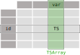

# Motivation: dealing with (spatial) Time series data

## 

Example spatial time series (TS) :clock1: data:

> * Consider 1 month of weather stations observations every 10 mins
* Which data structure would you use?

## 

<div>
<table border="1" class="dataframe">
	<thead>
	    <tr>
		<th>station</th>
		<th colspan="3" halign="left">1</th>
		<th>...</th>
		<th colspan="3" halign="left">33</th>
	    </tr>
	    <tr>
		<th>variable</th>
		<th>temperature</th>
		<th>water_vapour</th>
		<th>precipitation</th>
		<th>...</th>
		<th>temperature</th>
		<th>water_vapour</th>
		<th>precipitation</th>
	    </tr>
	    <tr>
		<th>time</th>
		<th></th>
		<th></th>
		<th></th>
		<th></th>
		<th></th>
		<th></th>
		<th></th>
	    </tr>
	</thead>
	<tbody>
	    <tr>
		<th>2021-01-01 00:00:00</th>
		<td>2.2</td>
		<td>99.0</td>
		<td>0.2</td>
		<td>...</td>
		<td>3.4</td>
		<td>92.0</td>
		<td>0.1</td>
	    </tr>
	    <tr>
		<th>2021-01-01 00:10:00</th>
		<td>2.3</td>
		<td>99.0</td>
		<td>0.2</td>
		<td>...</td>
		<td>3.2</td>
		<td>92.0</td>
		<td>0.1</td>
	    </tr>
	    <tr>
		<th>2021-01-01 00:20:00</th>
		<td>2.4</td>
		<td>99.0</td>
		<td>0.1</td>
		<td>...</td>
		<td>3.2</td>
		<td>92.0</td>
		<td>0.2</td>
	    </tr>
	    <tr>
		<th>...</th>
		<td>...</td>
		<td>...</td>
		<td>...</td>
		<td>...</td>
		<td>...</td>
		<td>...</td>
		<td>...</td>
	    </tr>
	    <tr>
		<tr>
		<th>2021-01-31 23:30:00</th>
		<td>6.1</td>
		<td>99.0</td>
		<td>0.2</td>
		<td>...</td>
		<td>6.9</td>
		<td>80.0</td>
		<td>0.0</td>
		</tr>	
	    <tr>
		<th>2021-01-31 23:40:00</th>
		<td>6.1</td>
		<td>98.0</td>
		<td>0.3</td>
		<td>...</td>
		<td>6.9</td>
		<td>81.0</td>
		<td>0.0</td>
	    </tr>
	    <tr>
		<th>2021-01-31 23:50:00</th>
		<td>6.1</td>
		<td>99.0</td>
		<td>0.3</td>
		<td>...</td>
		<td>6.8</td>
		<td>82.0</td>
		<td>0.2</td>
	    </tr>
	</tbody>
</table>
<p>4464 rows × 99 columns</p>
</div>

## Wide data frame {.no-bullet}

> * **Pros**: 
  * :thumbsup: Efficient TS :clock1: operations on index, e.g., `df.resample`
* **Cons**:  
  * :thumbsdown:Requires **aligned** TS :clock1:
  * :thumbsdown:Cannot add station attributes, e.g., "geometry" :earth_africa: column
* Alternatives?

## Long data frame

<div>
<table border="1" class="dataframe">
  <thead>
    <tr style="text-align: right;">
      <th></th>
      <th>variable</th>
      <th>temperature</th>
      <th>water_vapour</th>
      <th>precipitation</th>
    </tr>
    <tr>
      <th>station</th>
      <th>time</th>
      <th></th>
      <th></th>
      <th></th>
    </tr>
  </thead>
  <tbody>
    <tr>
      <th rowspan="5" valign="top">1</th>
      <th>2021-01-01 00:00:00</th>
      <td>2.2</td>
      <td>99.0</td>
      <td>0.2</td>
    </tr>
    <tr>
      <th>2021-01-01 00:10:00</th>
      <td>2.3</td>
      <td>99.0</td>
      <td>0.2</td>
    </tr>
    <tr>
      <th>2021-01-01 00:20:00</th>
      <td>2.4</td>
      <td>99.0</td>
      <td>0.1</td>
    </tr>
    <tr>
      <th>2021-01-01 00:30:00</th>
      <td>2.4</td>
      <td>99.0</td>
      <td>0.2</td>
    </tr>
    <tr>
      <th>2021-01-01 00:40:00</th>
      <td>2.5</td>
      <td>99.0</td>
      <td>0.2</td>
    </tr>
    <tr>
      <th>...</th>
      <th>...</th>
      <td>...</td>
      <td>...</td>
      <td>...</td>
    </tr>
    <tr>
      <th rowspan="5" valign="top">33</th>
      <th>2021-01-31 23:10:00</th>
      <td>5.6</td>
      <td>100.0</td>
      <td>0.1</td>
    </tr>
    <tr>
      <th>2021-01-31 23:20:00</th>
      <td>5.6</td>
      <td>100.0</td>
      <td>0.0</td>
    </tr>
    <tr>
      <th>2021-01-31 23:30:00</th>
      <td>5.7</td>
      <td>100.0</td>
      <td>0.2</td>
    </tr>
    <tr>
      <th>2021-01-31 23:40:00</th>
      <td>5.4</td>
      <td>100.0</td>
      <td>0.1</td>
    </tr>
    <tr>
      <th>2021-01-31 23:50:00</th>
      <td>5.3</td>
      <td>100.0</td>
      <td>0.4</td>
    </tr>
  </tbody>
</table>
<p>147312 rows × 3 columns</p>
</div>

## Long data frame {.no-bullet}

> * **Pros**: 
     * :thumbsup: Flexible for **unaligned** TS :clock1:
* **Cons**:
     * :thumbsdown:TS :clock1: operations require a *groupby* approach
     * :thumbsdown: station attributes, e.g., "geometry" :earth_africa: column would result in many repeated values
* Alternatives?

## Combine two objects

> * A wide time series data frame
* A station attributes data frame/series, e.g., "geometry" :earth_africa:

## Vector data cubes: xvec

<div class="fragment" data-fragment-index="1">

</div>

## Vector data cubes: xvec {.code-mb-0}

```python
# e.g., stations within 10 km of Lausanne's center
query_geom = gpd.tools.geocode("Lausanne").to_crs(ds.station.crs).buffer(10e3)
ds.xvec.query("station", query_geom)
```


## Vector data cubes: xvec {.no-bullet}

> * **Pros**: 
  * :thumbsup: Efficient TS :clock1: operations on time index, e.g., `ds.resample`
  * :thumbsup: Efficient spatial :earth_africa: operations on spatial index
* **Cons**:  
  * Requires **aligned** TS :clock1:
  * How to store to disk :floppy_disk:? [<i class="fa fa-github"></i> xvec/issues/26](https://github.com/xarray-contrib/xvec/issues/26)
  * **pickle**, **joblib**: Python only.
  * **GIS formats**: pros and cons of wide/long tables.


## Summary

We could not find a tool to deal with:

> * unaligned time series
* reliable disk storage, e.g., long term, cross-platform, cloud optimized...
* station (sample) attributes, e.g., "geometry" :earth_africa:


# Proposed solution: Enter TStore

## What is TStore

[<i class="fa fa-github"></i> TStore](https://github.com/ltelab/tstore) is a Python library for flexible storage and processing of (spatial) TS data. Two key features:

> * **TS :clock1: encapsulation**: `TS`, `TSDF`, `TSLong` and `TSWide` objects to organize hetereogeneous (spatial) time series data into Python data frames
* **TS :clock1: storage**: `TStore` is a hierarchically-structured specification to reliably and efficiently store (spatial) TS data based on Parquet (and GeoParquet)

## Time series encapsulation

Consider a `TS` object representing a time-series. Then the long data frame becomes:


<div class="fragment" data-fragment-index="1">
<table border="1" class="dataframe">
  <thead>
    <tr style="text-align: right;">
      <th></th>
      <th>data</th>
    </tr>
    <tr>
      <th>station</th>
      <th></th>
    </tr>
  </thead>
  <tbody>
    <tr>
      <th>1</th>
      <td>TS[shape=(4464, 3),start=2021-01-01 00:00:00,e...</td>
    </tr>
    <tr>
      <th>2</th>
      <td>TS[shape=(4464, 3),start=2021-01-01 00:00:00,e...</td>
    </tr>
    <tr>
      <th>3</th>
      <td>TS[shape=(4464, 3),start=2021-01-01 00:00:00,e...</td>
    </tr>
    <tr>
      <th>...</th>
      <td>...</td>
    </tr>
    <tr>
      <th>31</th>
      <td>TS[shape=(4464, 3),start=2021-01-01 00:00:00,e...</td>
    </tr>
    <tr>
      <th>32</th>
      <td>TS[shape=(4464, 3),start=2021-01-01 00:00:00,e...</td>
    </tr>
    <tr>
      <th>33</th>
      <td>TS[shape=(4464, 3),start=2021-01-01 00:00:00,e...</td>
    </tr>
  </tbody>
</table>
</div>

## Advantages {.no-bullet}

> * **Flexibility**: 
* :thumbsup: each station can have its own `TS`, e.g., useful with different temporal resolution, periods of maintenance (no data)...
* :thumbsup: each `TS` object may be *univariate* or *multivariate*

##

<div>
<table border="1" class="dataframe">
  <thead>
    <tr style="text-align: right;">
      <th></th>
      <th>temperature</th>
      <th>water_vapour</th>
      <th>precipitation</th>
    </tr>
    <tr>
      <th>station</th>
      <th></th>
      <th></th>
      <th></th>
    </tr>
  </thead>
  <tbody>
    <tr>
      <th>1</th>
      <td>TS[shape=(4464,),start=2021-01-01 00:00:00,end...</td>
      <td>TS[shape=(4464,),start=2021-01-01 00:00:00,end...</td>
      <td>TS[shape=(4464,),start=2021-01-01 00:00:00,end...</td>
    </tr>
    <tr>
      <th>2</th>
      <td>TS[shape=(4464,),start=2021-01-01 00:00:00,end...</td>
      <td>TS[shape=(4464,),start=2021-01-01 00:00:00,end...</td>
      <td>TS[shape=(4464,),start=2021-01-01 00:00:00,end...</td>
    </tr>
    <tr>
      <th>3</th>
      <td>TS[shape=(4464,),start=2021-01-01 00:00:00,end...</td>
      <td>TS[shape=(4464,),start=2021-01-01 00:00:00,end...</td>
      <td>TS[shape=(4464,),start=2021-01-01 00:00:00,end...</td>
    </tr>
    <tr>
      <th>...</th>
      <td>...</td>
      <td>...</td>
      <td>...</td>
    </tr>
    <tr>
      <th>31</th>
      <td>TS[shape=(4464,),start=2021-01-01 00:00:00,end...</td>
      <td>TS[shape=(4464,),start=2021-01-01 00:00:00,end...</td>
      <td>TS[shape=(4464,),start=2021-01-01 00:00:00,end...</td>
    </tr>
    <tr>
      <th>32</th>
      <td>TS[shape=(4464,),start=2021-01-01 00:00:00,end...</td>
      <td>TS[shape=(4464,),start=2021-01-01 00:00:00,end...</td>
      <td>TS[shape=(4464,),start=2021-01-01 00:00:00,end...</td>
    </tr>
    <tr>
      <th>33</th>
      <td>TS[shape=(4464,),start=2021-01-01 00:00:00,end...</td>
      <td>TS[shape=(4464,),start=2021-01-01 00:00:00,end...</td>
      <td>TS[shape=(4464,),start=2021-01-01 00:00:00,end...</td>
    </tr>
  </tbody>
</table>
</div>

## {.img-no-margin}

`TSDF` object



> * cells `TS` are pandas `ExtensionDtype`
* columns `TSArray` are pandas `ExtensionArray`

## Advantages {.img-no-margin .no-bullet}

GeoPandas compatible:


> * No geometries are repeated

## Time series storage {.no-bullet}

> * **TStore**: hierarchically-structured specification to efficiently store time series using [Apache Parquet](https://parquet.apache.org)
* :construction: when geometries are present, use [GeoParquet](https://github.com/opengeospatial/geoparquet)


##

Consider k years of temperature and precipitation data form n stations. Then, the `TStore` looks like:

<div>
<table class="tstore-table">
<tr>
<td>
```
<base_tstore_dir>
├── <station-id-1>
│   ├── <temperature>
│   │   ├── <year-1>
│   │   │   ...
│   │   └── <year-k>
│   └── <precipitation>
│       ├── <year-1>
│       │   ...
│       └── <year-k>
...

```
</td>
<td>
```

...
		
└── <station-id-n>
    ├── <temperature>
    │   ├── <year-1>
    │   │   ...
    │   └── <year-k>
    └── <precipitation>
        ├── <year-1>
        │   ...
        └── <year-k>
```
</td>
</tr> 
</table>
</div>

## Flexibility of TStore {.no-bullet}

We can ...

> * have multiple temporal partitioning, e.g., by month, year/month...
* TStore structure, e.g., "variable-station" instead of "station-variable"

## Advantages {.no-bullet}

> * `TS` objects are loaded into the Apache Arrow memory format
* :arrow_right: *zero-copy* conversion to pandas or polars dataframes.

## Example {.no-bullet}

5 years of 10 min observations from the 33 Agrometeo stations[<sup>1</sup>](#agrometeo) in the Canton of Vaud, Switzerland:


<div class="fragment" data-fragment-index="1">
<table border="1" class="dataframe">
  <thead>
    <tr style="text-align: right;">
      <th></th>
      <th>variable</th>
      <th>temperature</th>
      <th>water_vapour</th>
      <th>precipitation</th>
    </tr>
    <tr>
      <th>station</th>
      <th>time</th>
      <th></th>
      <th></th>
      <th></th>
    </tr>
  </thead>
  <tbody>
    <tr>
      <th rowspan="3" valign="top">1</th>
      <th>2019-06-01 00:00:00</th>
      <td>17.0</td>
      <td>57.0</td>
      <td>0.0</td>
    </tr>
    <tr>
      <th>2019-06-01 00:10:00</th>
      <td>16.5</td>
      <td>60.0</td>
      <td>0.0</td>
    </tr>
    <tr>
      <th>2019-06-01 00:20:00</th>
      <td>16.3</td>
      <td>59.0</td>
      <td>0.0</td>
    </tr>
    <tr>
      <th>...</th>
      <th>...</th>
      <td>...</td>
      <td>...</td>
      <td>...</td>
    </tr>
    <tr>
      <th rowspan="3" valign="top">305</th>
      <th>2024-04-30 23:30:00</th>
      <td>14.9</td>
      <td>74.0</td>
      <td>0.0</td>
    </tr>
    <tr>
      <th>2024-04-30 23:40:00</th>
      <td>15.3</td>
      <td>69.0</td>
      <td>0.0</td>
    </tr>
    <tr>
      <th>2024-04-30 23:50:00</th>
      <td>15.3</td>
      <td>67.0</td>
      <td>0.0</td>
    </tr>
  </tbody>
</table>
<p>8534361 rows × 3 columns</p>
</div>

##

```python
import tstore

tstore_dir = "agrometeo-tstore"
variables =...

tslong = tstore.TSLong(long_ts_df)
tslong.to_tstore(
    tstore_dir,
    variables,
    # TSTORE options
    partitioning="year",
    tstore_structure="id-var"
)
```

##

Resulting TStore directory structure:

<div>
<table class="tstore-table">
<tr>
<td>
```
agrometeo-tstore/
├── tstore_metadata.yaml
├── _attributes.parquet
├── 96/
│   └── temperature/
│       ├── _common_metadata
│       ├── _metadata
│       └── year=2020/
│           └── part-0.parquet
│       └── ...
...
```
</td>
<td>
```
...
└── 27/
    └── precipitation/
        ├── year=2019/
        │   └── part-0.parquet
        ├── year=2021/
        │   └── part-0.parquet
        ├── year=2022/
        │   └── part-0.parquet
        ├── year=2023/
        │   └── part-0.parquet
        └── year=2024/
            └── part-0.parquet
		
```
</td>
</tr> 
</table>
</div>

## Some stats {.no-bullet}

|                | write [s] | read [s] | size [MB] |
|----------------|-----------|----------|-----------|
| CSV            | 116.4     | 8.96     | 310.5     |
| TStore, snappy | 6.1       | 22.2     | 249.9     |
| TStore, gzip   | 12.9      | 21.6     | 194.4     |

# Thank you

<div class="thank-you-links">
Slides: [<i class="fa fa-github"></i> martibosch/tsdf-geopython-2024](https://github.com/martibosch/tsdf-geopython-2024)

Repository: [<i class="fa fa-github"></i> ltelab/tstore](https://github.com/ltelab/tstore)
</div>

<div>
<table class="logo-table">
	<tr>
	    <td>
			<a href="https://www.epfl.ch/labs/ceat" target="_blank">CEAT</a>
	    </td>
	    <td>
			<a href="https://www.epfl.ch/labs/lte" target="_blank">LTE</a>
	    </td>
	    <td>
			<a href="https://www.epfl.ch/schools/enac/about/data-at-enac/enac-it4research" target="_blank">ENAC-IT4R</a>
	    </td>
	    <td>
			<a href="https://www.epfl.ch" target="_blank">EPFL</a>
	    </td>
	</tr> 
	<tr>
	    <td>
		
	    </td>
	    <td>
		
	    </td>
	    <td>
		
	    </td>
	    <td>
		
	    </td>
	</tr> 
</table>
</div>


# Footnotes

1. <span id="agrometeo"></span> Data from Agrometeo belongs to the Swiss Federal Administration, see [the terms and conditions](https://www.admin.ch/gov/en/start/terms-and-conditions.html) for more information.
